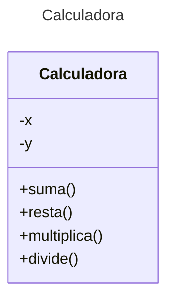

# Proyecto - Java Calculadora con Pruebas para Autograding - Maven

Plantilla básica para proyecto de Java con Autograding usando Maven

# Diagrama de clases
[Editor en línea](https://mermaid.live/)

[Referencia-Mermaid](https://mermaid.js.org/syntax/classDiagram.html)

## Prompt para generar el Diagrama de Clases con IA - mermAID
```
@mermaid /uml
```
## Diagrama de clases UML con draw.io

El repositorio está configurado para crear Diagramas de clases UML con ```draw.io```. Para usarlo simplemente das doble clic en el archivo  ```uml.class.drawio.png``` y se activará el editor ```draw.io``` incrustado en ```VSCode``` para edición. Asegúrate de agregar las formas UML en el menú de formas del lado izquierdo (opción ```+Más formas```). Al final insertas el archivo ```uml.class.drawio.png``` en apartado de UML de este archivo README.

Para más información consulta el [MarketPlace](https://marketplace.visualstudio.com/items?itemName=hediet.vscode-drawio).

## Uso del proyecto con Maven

### Compilar
```
mvn compile
```
### Probar N tests
```
mvn test
```
### Probar 1 test
```
mvn test -Dtest="AppTest#testSuma"
mvn test -Dtest="AppTest#testResta"
mvn test -Dtest="AppTest#testMultiplica"
mvn test -Dtest="AppTest#testDivide"
``` 
### Ejecutar App
```
java -cp target/classes miPrincipal.App
```
### Ejecutar App con mvn exec:java
```
mvn -q exec:java
```
### Empacar App
```
mvn package
```
### Limpiar binarios
```
mvn clean
```
## Comandos Git-Cambios y envío a Autograding

### Por cada cambio importante que haga, actualice su historia usando los comandos:
```
git add .
git commit -m "Descripción del cambio"
```
### Envíe sus actualizaciones a GitHub para Autograding con el comando:
```
git push origin main
```
Los comandos anteriores están considerados para un ambiente Linux. [Referencia.](https://www.baeldung.com/junit-run-from-command-line)
