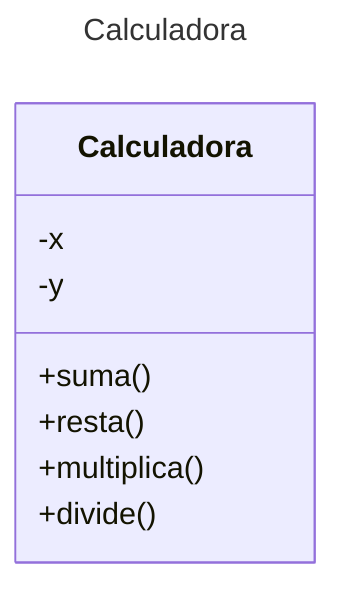

# Proyecto - Calculadora aritmética

Proyecto Java con Autograding

# Diagrama de clases
[Editor en línea](https://mermaid.live/)

```mermaid
---
title: Calculadora
---
classDiagram
      class Calculadora
      Calculadora: -x
      Calculadora: -y
      Calculadora: +suma()
      Calculadora: +resta()
      Calculadora: +multiplica()
      Calculadora: +divide()
```
[Referencia-Mermaid](https://mermaid.js.org/syntax/classDiagram.html)
# Uso del proyecto con make

## Ejecutar
```
gradle run
```
## Probar localmente
```
gradle test
```
* Desinstalar/Instalar gradle

En caso de mal funcionamiento de gradle se puede desintalar/instalar:
```
sdk uninstall gradle 8.0.2
sdk install gradle
```
* Gradle disponibles en la máquina virtual
```
sdk list gradle
```
# Comandos Git-Cambios y envío a Autograding

## Por cada cambio importante que haga, actualice su historia usando los comandos:
```
git add .
git commit -m "Descripción del cambio"
```
## Envíe sus actualizaciones a GitHub para Autograding con el comando:
```
git push origin main
```
